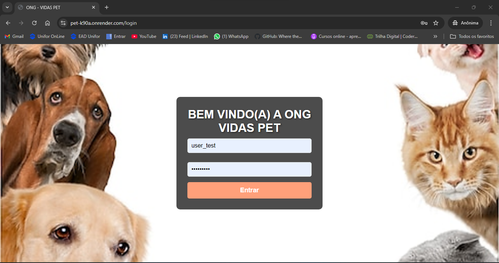
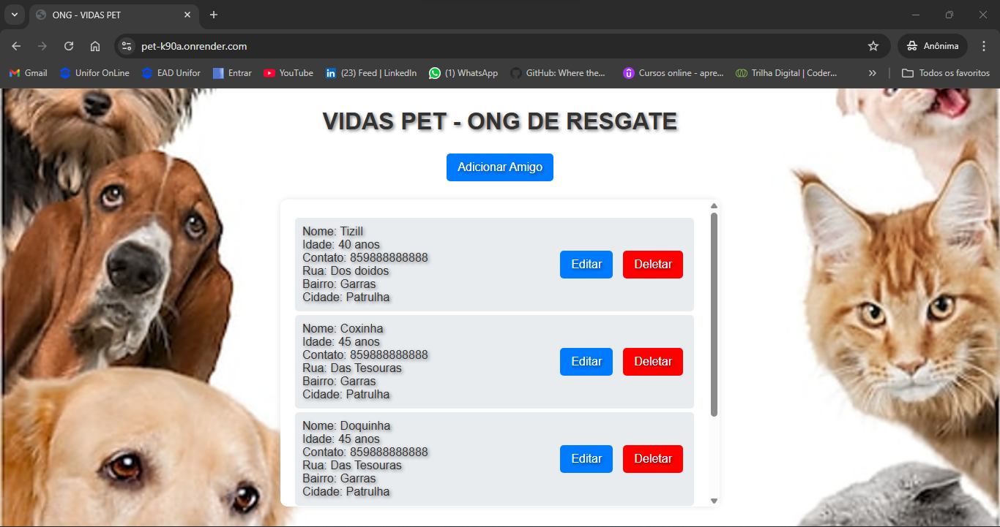
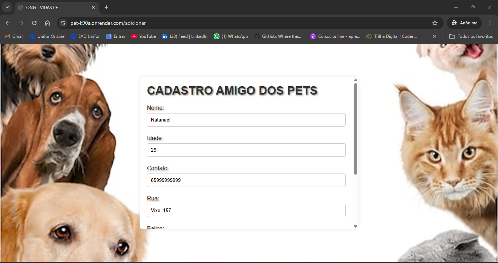
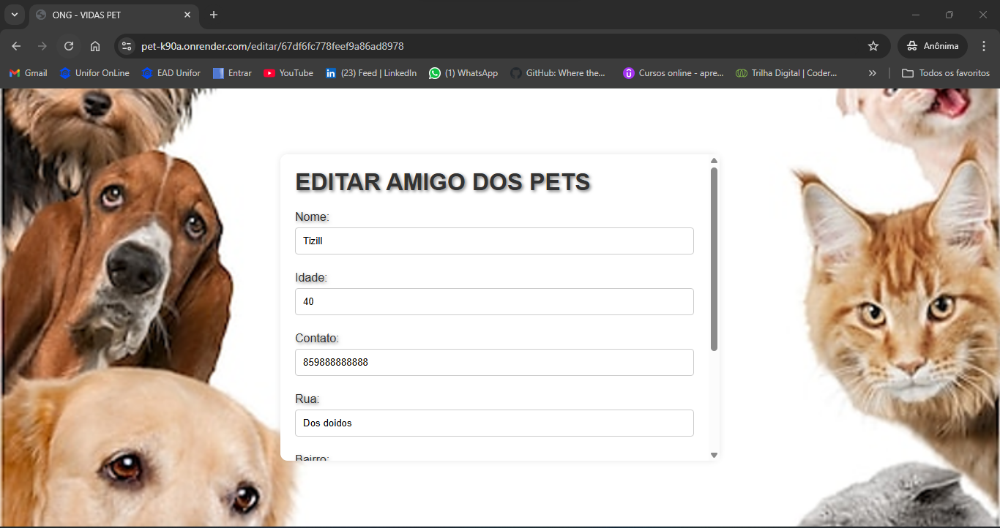
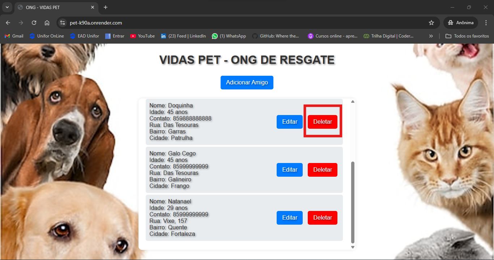
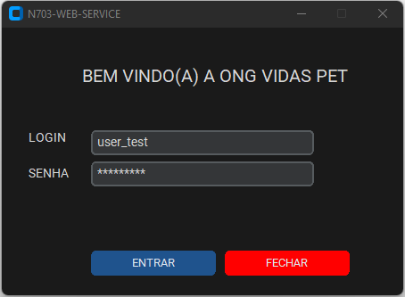
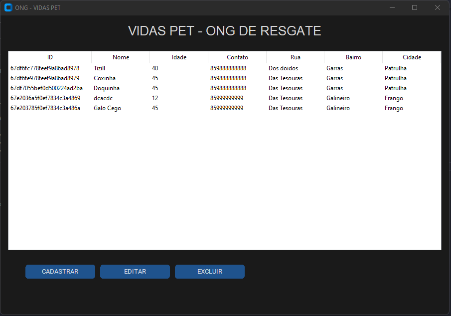
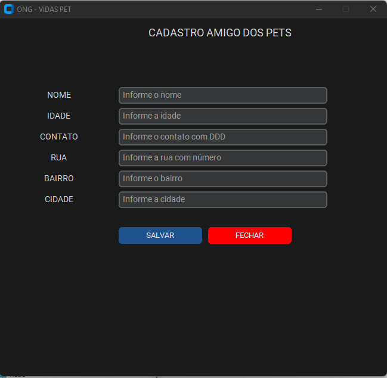
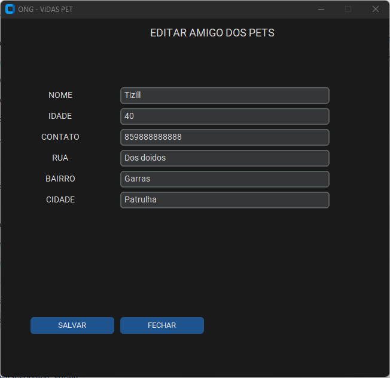
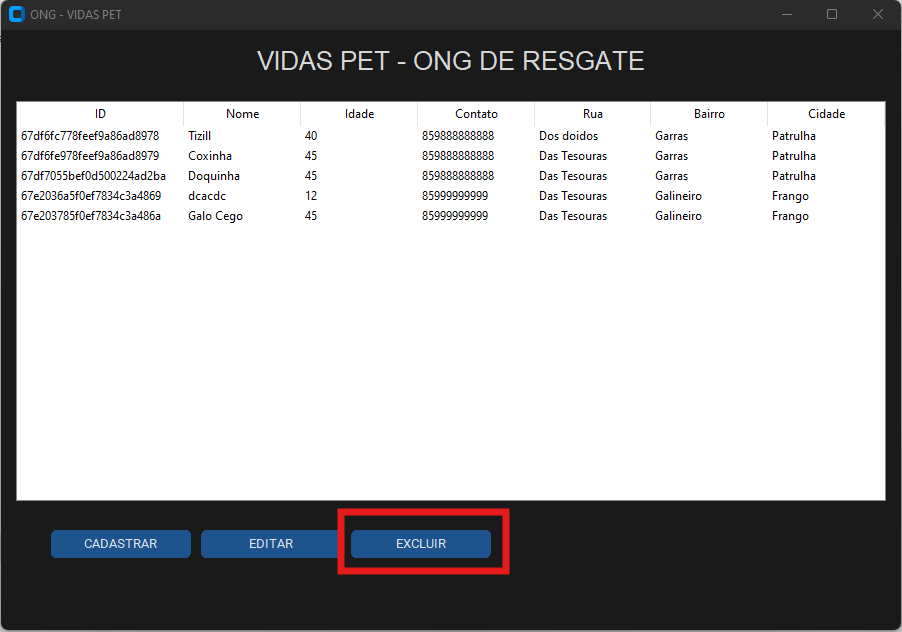

Porjeto de web service.

1 - Aplicação web para cadastro de contatos dos voluntários da ONG VIDAS PET  

* Aplicação criada com HTML, CSS, Flesk e Mongo DB. 
 --> Font End: HTML, CSS 
 --> Back-end: Flask 
 --> Banco de dados: MongoDB  

 * O site está hospedado de forma gratuita no RENDER, caso o link abaixo demore a carregar, gentileza acessa a pasta: 
 --> /1 - WEB e executar o arquivo app.py e assim abrirar a tela do seu navegador com a aplicação. 
 * Link: https://pet-k90a.onrender.com   

* Tela de Login - WEB: 
 

* Tela Principal - WEB: 
 

* Tela de Cadastro de Amigo - WEB: 
 

* Tela de Edição de Amigo - WEB: 
 

* Boatão de Exclusão - WEB: 
 

2 - Aplicativo desktop para cadastro de contatos dos voluntários da ONG VIDAS PET. 

* Aplicativo criado com python 

--> Interface: Biblioteca CustomTkinter 
--> Logica/Back-end: Python 
--> Banco de dados: MongoDB (utilizando a biblioteca pymongo)  

* Para executar o aplicativo, gentileza acessar o caminho: 
--> /0 - APP/APP_EXE e executar o aplicativo N703_APP.exe  

* Tela de Login - APP: 
 

* Tela Principal - APP: 
 

* Tela de Cadastro de Amigo - APP: 
 

* Tela de Edição de Amigo - APP: 
 

* Boatão de Exclusão - APP 
   

* Para entra no site ou aplicativo é necessário usuário e senha, gentileza utilizar as credenciais abaixo:

* login = user_test 
* senha = user_test 
